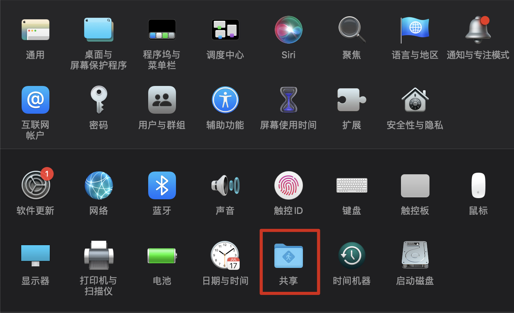
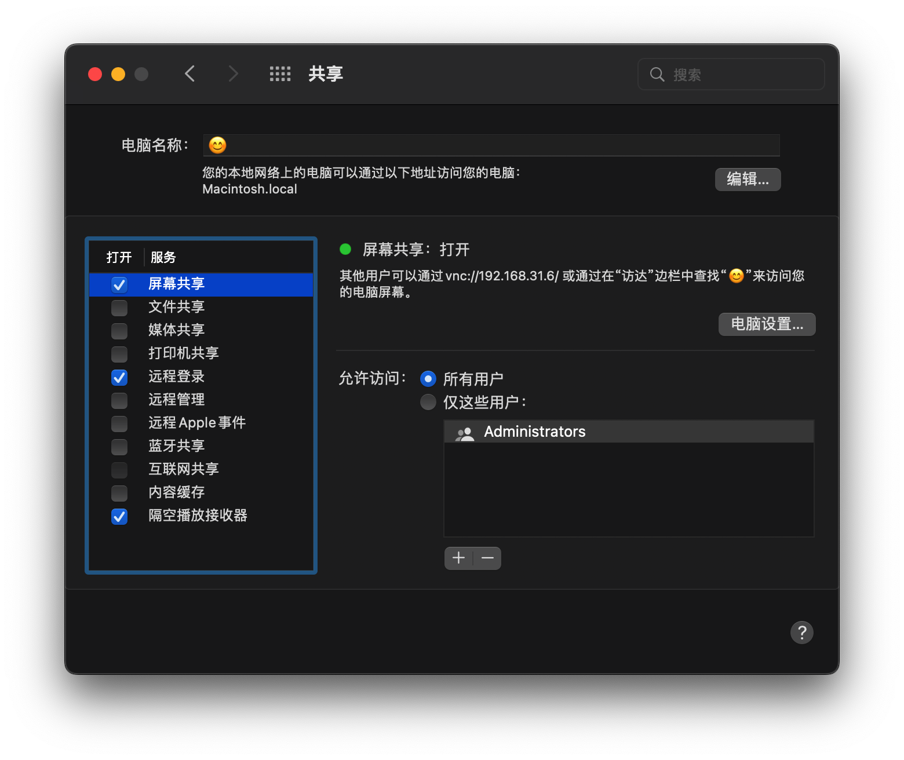
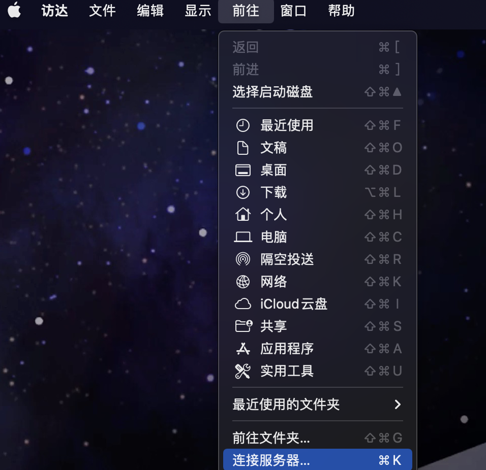
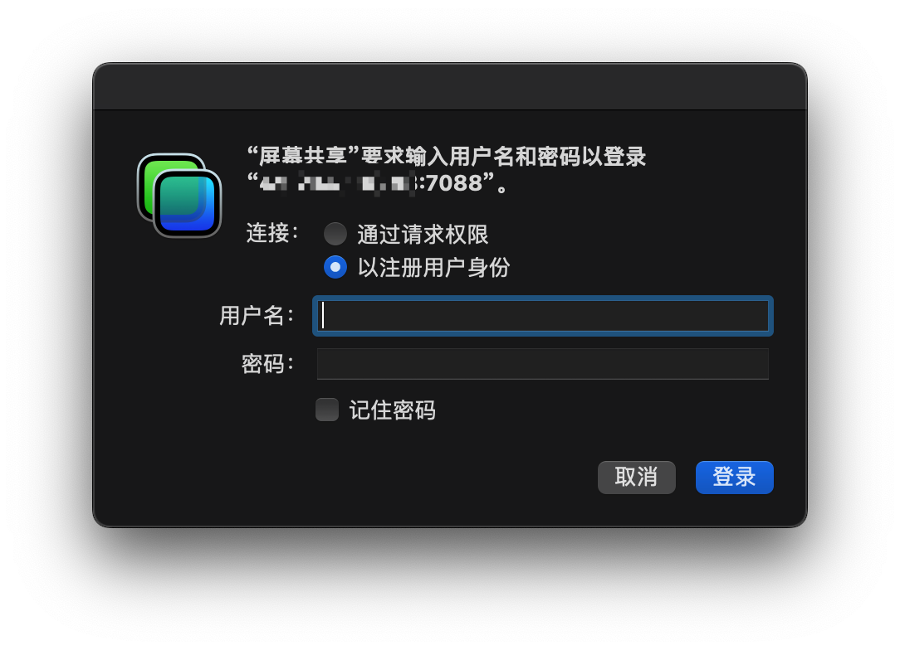

> 摘要：有时候我们想要通过远程服务器来调用本地的一些服务，或者想要想要远程来控制本地电脑。这时候我们就可以通过frp来进行搭建
>
> 需要准备的东西有：
>
> 1.一台可以链接到公网的服务器
>
> 2.可以访问互联网的Mac

## 公网服务器部署FRP服务端

> 这里使用 `docker` 安装 `frp`

### 先pull镜像

```shell
docker pull snowdreamtech/frps
```

### 准备文件夹放置配置文件

```shell
mkdir frp
```

新建配置文件 `frps.ini`如下

```yaml
[common]
bind_port = 7000
vhost_http_port = 7080
vhost_https_port = 7081
dashboard_addr = 0.0.0.0
dashboard_port = 7500
dashboard_user = admin
dashboard_pwd = admin
```

 `dashboard` 的账号密码可以自己定义。

### 运行容器

运行 `docker` 命令启动容器。注意 `/home/frp/frps.ini` 这里为你刚刚新建的路径

```shell
docker run -d --restart always --network host --name frps -v /home/frp/frps.ini:/etc/frp/frps.ini snowdreamtech/frps
```

这里 `–network host: host` 我设置的是所有容器端口都对应属主机端口，不存在映射关系。

### 访问frps界面

直接访问 `公网地址：7500` ， 输入账号密码就可直接访问


## 安装frps客户端

[下载 FRP 程序](https://github.com/fatedier/frp/releases) ，Mac 版的名字是这样的 `frp_x.x.x_darwin_amd64.tar.gz`，并解压。

### 设置配置文件

这里我们只用设置 `frpc.ini` 配置文件

```bash
[common]
server_addr = 公网地址
server_port = 7000
# auth 和服务端保持一致
tls_enable = true

#下面是我需要开启的服务，按自己需求自定义
[ssh]
type = tcp
local_ip = 127.0.0.1
local_port = 5900
remote_port = 7088
```

执行 `./frpc -c ./frpc.ini` 启动连接，正常启动如下图。

## 开启远程桌面或 SSH 登录

打开设置开启 `mac` 屏幕共享和远程访问功能



如图所示勾选屏幕共享和远程登录



## VNC登录远程桌面

打开“访达（Finder）”，选择菜单【前往】->【链接服务器】，输入
`vnc://x.x.x.x:7088`（将 `x.x.x.x` 替换成公网服务器 IP 地址）



输入地址确认后，如果连接成功，就可以选择登录方式



##  添加自动启动

#### 4.1 将 frps 加入自动启动

进入公网服务器，执行下列命令：

```awk
sudo cp /xxx/frps /usr/bin/       # 将执行文件移入系统目录
sudo cp /xxx/frps.ini /etc/frp/   # 将配置文件移入系统配置目录

# 添加自启动配置
sudo cp /xxx/systemd/frps.service /lib/systemd/system/ 

sudo systemctl daemon-reload       # 重新加载配置
sudo systemctl enable frps.service # 启用 frps 开机启动
sudo systemctl start frps.service  # 启动 frps 服务
systemctl status frps.service      # 查看 frps 服务状态
```

#### 4.2 将 frpc 加入自动启动

进入内网 Mac 系统，执行下列操作：

```awk
# 编辑自启动文件
touch ~/Library/LaunchAgents/frpc.plist
vim ~/Library/LaunchAgents/frpc.plist
```

`frpc.plist` 文件内容如下，注意文件中的 `frpc` 和 `frpc.ini` 路径，可以将这两个文件移到下方配置文件的路径下：

```xml
<?xml version="1.0" encoding="UTF-8"?>
<!DOCTYPE plist PUBLIC -//Apple Computer//DTD PLIST 1.0//EN
http://www.apple.com/DTDs/PropertyList-1.0.dtd >
<plist version="1.0">
<dict>
    <key>Label</key>
    <string>frpc</string>
    <key>ProgramArguments</key>
    <array>
     <string>/usr/local/bin/frpc/frpc</string>
         <string>-c</string>
     <string>/usr/local/bin/frpc/frpc.ini</string>
    </array>
    <key>KeepAlive</key>
    <true/>
    <key>RunAtLoad</key>
    <true/>
</dict>
</plist>
```

加载并生效：

```arcade
sudo chown root ~/Library/LaunchAgents/frpc.plist
sudo launchctl load -w ~/Library/LaunchAgents/frpc.plist
```

别忘了还需要保证 Mac 处于开机运行状态。至此，所有的配置都完成了。

## 参考文章

[通过 FRP 内网穿透并实现 VNC 远程访问 Mac 桌面](https://segmentfault.com/a/1190000021724321)

[docker安装frp，实现内网穿透](https://www.tootootool.com/?p=290)
